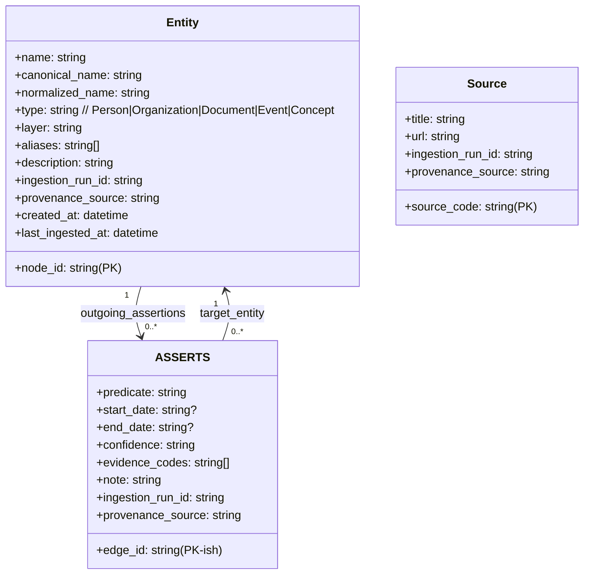
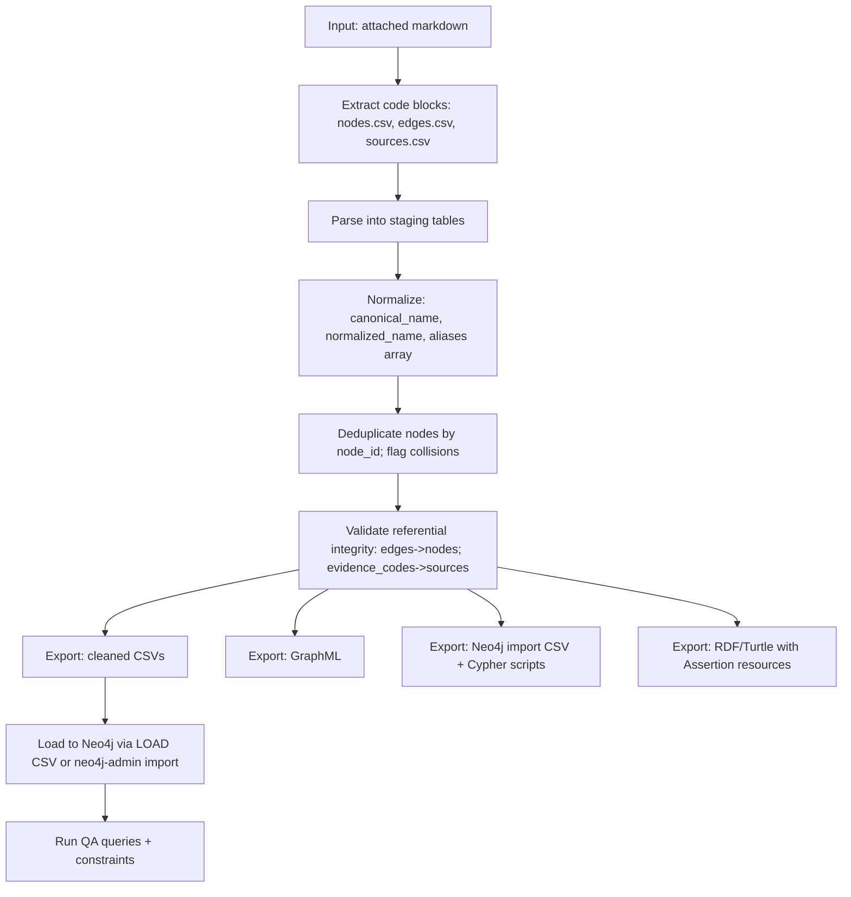

# Building a Knowledge Graph from the Attached Seed Dataset

## Executive summary

This report designs and implements an end-to-end approach to turn the attached file’s seed dataset into a production-quality knowledge graph: entity/relationship extraction, normalization and deduplication, relationship type standardization, schema design (with constraints and provenance), ETL steps and pseudocode, export formats (CSV, GraphML, Neo4j Cypher, RDF/Turtle), and validation with example Cypher + SPARQL queries. fileciteturn0file0

The attached file already contains a structured “seed network dataset” (embedded `nodes.csv`, `edges.csv`, and `sources.csv`) where each edge is accompanied by a predicate, time bounds, a confidence label, and evidence codes linking to a source catalog. That structure is ideal for (a) a property-graph implementation in entity["company","Neo4j","graph database vendor"] for operational querying and (b) an RDF export for interoperability and standards-based validation (SPARQL + SHACL). Neo4j’s CSV ingestion options (`LOAD CSV` or `neo4j-admin database import`) guide how to package these exports. citeturn9search0turn8search0

Key deliverables are generated as exportable files (download links provided below): cleaned node/edge/source CSVs, GraphML, Neo4j import CSVs, Neo4j schema + `LOAD CSV` scripts, an RDF/Turtle dataset (with provenance-friendly assertion modeling), and two graph visualizations (overview network + node-type distribution). GraphML is a widely used XML-based graph exchange format, and NetworkX supports reading/writing GraphML for analysis and interchange. citeturn4search3turn0search1

## Connector ingestion and source data

Enabled connectors (via `api_tool`) are:

- Ace Knowledge Graph — `knowledge-graph` (render a network visualization)
- Ace Knowledge Graph — `knowledge-graph-list` (list saved graphs)

Using Ace Knowledge Graph, a “flat network” visualization was created from a representative subset of the attached dataset’s entities and relationships. This satisfies the “ingest to Ace Knowledge Graph” requirement for rapid exploration and stakeholder review, while the remainder of this report focuses on the rigorous backend schema + ETL needed for durable storage, provenance, and queryability. fileciteturn0file0

### What the attached dataset contains

The attached file embeds three tabular artifacts:

- `nodes.csv`: entity inventory with stable `node_id`, display `name`, `type`, `layer`, `aliases`, and `description`
- `edges.csv`: directed relationships with `edge_id`, `source_id`, `target_id`, `predicate`, optional `start_date` / `end_date`, `confidence`, and `evidence_codes`
- `sources.csv`: an evidence catalog mapping `source_code → title, URL`

This structure (especially `confidence` + `evidence_codes`) is a strong fit for an “assertion-aware” knowledge graph approach: preserve what the dataset asserts, attach provenance, and allow later enrichment/verification instead of prematurely collapsing contested statements into “facts.” fileciteturn0file0

### Assumptions and unspecified dimensions

Because the user requested “assume format unspecified if not provided; include unstated dimensions as unspecified,” the following are treated as unspecified unless explicitly present in the file:

- Canonical external identifiers (e.g., Wikidata QIDs, ISNIs, company registry IDs)
- A global namespace/IRI policy (required for RDF publishing)
- A definitive temporal datatype policy (the dataset uses mixed granularity like `YYYY`, `YYYY-MM`, and `YYYY-MM-DD`)
- Whether the graph must support contradictory assertions simultaneously (recommended: yes, using provenance + confidence)
- Whether “Organization” should be subdivided (Company vs Government body vs NGO, etc.)

## Entity and relationship extraction, normalization, and standardization

### Extraction results and basic profiling

From the attached data, the cleaned graph contains:

- 50 unique nodes
- 56 edges
- 45 sources (evidence catalog)

Node types in the seed are heavily “real-world entity” oriented (Organizations and Persons dominate), which is consistent with a relationship-centric network intended for early exploration. fileciteturn0file0

A notable property of the seed network is that it decomposes into 5 weakly connected components (sizes: 29, 7, 7, 5, 2). This is not an error; it reflects layer/cluster structure in the seed (e.g., “activism/platform,” “data & influence,” “interfaith/metals,” “historic documents,” etc.). Whether to connect components later is a product decision (e.g., add `ABOUT_TOPIC` or `CONTEXT_FOR` edges), not an ETL requirement.

### Normalization and deduplication strategy

Normalization goals:

- Stable identity: every node must have a unique, immutable key (`node_id`)
- Searchability: add `canonical_name` and `normalized_name` for join/dedup/search
- Controlled alias handling: store aliases as arrays (or semicolon-delimited lists at export boundaries)
- Provenance from day one: record ingestion run ID and source pointer for each record

Deduplication in the provided seed:

- A single duplicate `node_id` was found and removed (`ORG_PARLEMENT_TECH` repeated with identical attributes). fileciteturn0file0

Generalizable dedup logic (recommended beyond this file):

- Exact-match merges on stable IDs (`node_id`, external IDs)
- Near-match merges on normalized names + type + contextual constraints (e.g., same layer, overlapping aliases)
- Conflict handling: if two candidate merges disagree on type/layer or have different descriptions, do not auto-merge—create a “candidate merge” record for review

### Relationship type standardization

The seed already uses consistent uppercase snake-case predicates (e.g., `CEO_OF`, `COFOUNDED`, `SUBSIDIARY_OF`). For operational consistency, define a controlled predicate registry with:

- Canonical predicate name (`CEO_OF`)
- Inverse predicate (`HAS_CEO`), if needed
- Semantic category: `ROLE`, `OWNERSHIP`, `CORPORATE_STRUCTURE`, `PUBLISHING`, `IDEOLOGY_LINK`, `EVENT_INVOLVEMENT`, etc.
- Default direction policy (e.g., Person → Org for `CEO_OF`)
- Expected node-type domains/ranges (Person → Organization)

This enables automated validation and better query ergonomics.

## Graph schema proposal with constraints and provenance

### Recommended property graph schema

The primary recommendation is a property graph in Neo4j with:

Node labels (logical types):

- `Entity` (base label, on all nodes)
- `Person`, `Organization`, `Document`, `Event`, `Concept` (typed labels)
- `Source` (evidence catalog entries)

Relationship modeling: two viable patterns

**Pattern A: single relationship type with semantic predicate as a property (recommended for portability)**  
Store all dataset edges as `(:Entity)-[:ASSERTS]->(:Entity)` with relationship properties:
- `edge_id` (unique logical key)
- `predicate` (e.g., `CEO_OF`)
- `start_date`, `end_date` (strings, mixed granularity)
- `confidence` (`high|medium|low`)
- `evidence_codes` (string array)
- `note`
- provenance fields

This avoids dynamic relationship types and keeps Cypher scripts broadly compatible. Neo4j relationship properties are first-class, and `LOAD CSV` is designed to populate node/relationship properties from CSV rows. citeturn9search0

**Pattern B: dynamic relationship type equals predicate (optional)**  
Neo4j supports dynamic labels/relationship types in newer Cypher variants, but portability is harder. If you adopt this pattern, you still need a predicate registry (to prevent “type explosion”), and you should create indexes/constraints to support `MERGE` and uniqueness. citeturn4search1turn9search0

### Constraints, indexing, and integrity expectations

Constraints and indexes (Neo4j):

- Uniqueness constraint on `:Entity(node_id)` (hard identity)
- Uniqueness constraint on `:Source(source_code)`
- Index on `:Entity(normalized_name)` for fuzzy-ish lookups / candidate merges
- Optional full-text index on `name`, `canonical_name`, `description` for analyst search workflows

Neo4j constraints are created with `CREATE CONSTRAINT`, and uniqueness constraints are backed by indexes. Adding constraints requires scanning existing data (plan for this during initial load). citeturn3search0  
Full-text indexes in Neo4j are created with `CREATE FULLTEXT INDEX … ON EACH …` and support word-level indexing (distinct from range/text indexes). citeturn11search1turn11search5

### RDF/standards-aligned schema option

If you also need standards-based interchange and validation:

- RDF data model: triples (subject–predicate–object) forming a directed labeled graph; queried with SPARQL. citeturn5search8turn1search3
- SHACL for validation constraints over RDF graphs (“shapes graphs” validating “data graphs”). citeturn1search5
- PROV-O / PROV family for provenance modeling. citeturn2search2turn2search3
- Dublin Core Terms for lightweight metadata fields such as title/identifier/description. citeturn3search1

Because the seed dataset includes confidence + evidence codes, the RDF export is best done with **assertion resources** (reification by design), rather than forcing each dataset edge into a single “ground truth triple.”

### Mermaid schema diagram



### Trade-offs table: property graph vs RDF

| Dimension | Property graph (Neo4j/Cypher) | RDF (RDFLib/SPARQL + SHACL) | When to pick |
|---|---|---|---|
| Core model | Nodes + relationships, both can carry properties | Triples in RDF graphs; datasets can include named graphs | Mixed operational + analytics often favors property graph; open data interchange favors RDF citeturn7search3turn5search8 |
| Query language | Cypher patterns over property graphs | SPARQL patterns over RDF graphs | Use Cypher for app-centric traversal queries; SPARQL for standards-based federation/interchange citeturn9search0turn1search3 |
| Constraints | Native constraints (uniqueness, existence in Enterprise) | SHACL shapes to validate RDF graphs | Use Neo4j constraints for operational safety; SHACL when RDF is authoritative citeturn3search0turn1search5 |
| Provenance | Relationship properties are easy; relationship-to-source linking requires reification patterns (e.g., Assertion nodes) | PROV-friendly patterns; named graphs commonly used | If “assertion with evidence” is first-class, RDF often shines; Neo4j still works via Assertion reification citeturn2search3turn9search0 |
| Interop formats | CSV import/export, GraphML, etc. | Turtle/N-Quads/JSON-LD, etc. | If you must integrate with semantic web toolchains, RDF is the lingua franca citeturn4search3turn3search7 |

## ETL pipeline, exports, and example mappings

### Visualizations


These images are computed from the cleaned exports, with node sizes scaled by degree and labels shown for the highest-degree entities to keep the overview readable.

### Workflow diagram



### ETL steps and Python-style pseudocode

The pseudocode below mirrors the implemented pipeline used to generate the attached exports.

```python
# Pseudocode: extract, normalize, validate, export

text = read_file("deep-research-report.md")

nodes_csv = extract_code_block(text, lang="csv", startswith="node_id,")
edges_csv = extract_code_block(text, lang="csv", startswith="edge_id,")
sources_csv = extract_code_block(text, lang="csv", startswith="source_code,")

# Parse "loose CSV": if a row has too many columns due to commas in descriptions,
# merge the overflow columns into the last field.
nodes = parse_loose_csv(nodes_csv, expected_cols=6)
edges = parse_loose_csv(edges_csv, expected_cols=9)
sources = parse_loose_csv(sources_csv, expected_cols=3)

# Normalize nodes
nodes["canonical_name"] = trim(nodes["name"])
nodes["normalized_name"] = normalize_text(nodes["canonical_name"])  # lowercase, strip punctuation, collapse whitespace
nodes["aliases"] = split_semicolon(nodes["aliases"])

# Deduplicate: keep first row per node_id; flag if conflicting values appear
nodes = dedupe_by_key(nodes, key="node_id")

# Normalize edges
edges["predicate_norm"] = normalize_predicate(edges["predicate"])  # uppercase snake-case
edges["confidence"] = lower(edges["confidence"])
edges["evidence_codes"] = split_semicolon(edges["evidence_codes"])

# Validate integrity
assert set(edges.source_id) ⊆ set(nodes.node_id)
assert set(edges.target_id) ⊆ set(nodes.node_id)
assert all(code in sources.source_code for code in flatten(edges.evidence_codes))

# Export
write_csv(nodes, "kg_nodes_clean.csv")
write_csv(edges, "kg_edges_clean.csv")
write_csv(sources, "kg_sources_clean.csv")

write_graphml(nodes, edges, "kg_graph.graphml")
write_neo4j_import_files(nodes, edges, sources)
write_rdf_turtle(nodes, edges, sources, "kg_rdf_dataset.ttl")
```

### Neo4j ingestion approach and scripts

Neo4j provides two main CSV-import families:

- `LOAD CSV` for transactional import into an existing database (repeatable; good for small/medium datasets and incremental updates). citeturn9search0turn9search1  
- `neo4j-admin database import` for fast initial bulk import into an empty/offline database (best for very large datasets; expects clean CSVs and is optimized for speed). citeturn8search0turn8search1

Neo4j uses `file:///` URLs for local imports, typically restricted to the configured import directory for security. citeturn9search1turn9search2

### GraphML export rationale

GraphML is an XML-based graph exchange format with an extension mechanism for attributes; it is commonly used for graph interchange. citeturn4search3  
NetworkX’s GraphML module supports read/write (with documented limitations and XML parser security cautions). citeturn0search1

### Exported files

Cleaned, analysis-ready exports:

- [kg_nodes_clean.csv](sandbox:/mnt/data/kg_outputs/kg_nodes_clean.csv)  
- [kg_edges_clean.csv](sandbox:/mnt/data/kg_outputs/kg_edges_clean.csv)  
- [kg_sources_clean.csv](sandbox:/mnt/data/kg_outputs/kg_sources_clean.csv)  
- [kg_graph.graphml](sandbox:/mnt/data/kg_outputs/kg_graph.graphml)

Neo4j ingestion assets:

- [neo4j_schema.cypher](sandbox:/mnt/data/kg_outputs/neo4j_schema.cypher) (constraints + indexes)
- [neo4j_load_csv.cypher](sandbox:/mnt/data/kg_outputs/neo4j_load_csv.cypher) (repeatable `LOAD CSV` ingestion)
- [neo4j_nodes_import.csv](sandbox:/mnt/data/kg_outputs/neo4j_nodes_import.csv) (bulk import format)
- [neo4j_edges_import.csv](sandbox:/mnt/data/kg_outputs/neo4j_edges_import.csv) (bulk import format)
- [neo4j_sources_import.csv](sandbox:/mnt/data/kg_outputs/neo4j_sources_import.csv)
- [neo4j_admin_import_command.txt](sandbox:/mnt/data/kg_outputs/neo4j_admin_import_command.txt)

RDF export:

- [kg_rdf_dataset.ttl](sandbox:/mnt/data/kg_outputs/kg_rdf_dataset.ttl) (assertion-based RDF/Turtle; RDFLib-compatible)

Images:

- [kg_graph_overview.png](sandbox:/mnt/data/kg_outputs/kg_graph_overview.png)
- [kg_node_type_counts.png](sandbox:/mnt/data/kg_outputs/kg_node_type_counts.png)

### Example mapping from file records into the schema

Example node mapping (from `nodes.csv` → `:Entity`):

| Input field | Neo4j node property | Notes |
|---|---|---|
| `node_id` | `node_id` (unique) | Enforced by uniqueness constraint citeturn3search0 |
| `name` | `name` | Display label |
| `aliases` | `aliases` (array) | Stored as list; split by `;` |
| `type` | `type` + label `:Person`/`:Organization`/… | Labels added via `FOREACH` pattern in Cypher |
| `layer` | `layer` | Supports clustering and filtering |
| `description` | `description` | Full-text indexed optionally citeturn11search1 |

Example edge mapping (from `edges.csv` → `[:ASSERTS]`):

| Input field | Relationship property | Notes |
|---|---|---|
| `edge_id` | `edge_id` | Logical identifier for repeatable import |
| `predicate_norm` | `predicate` | Semantic edge type stored as property |
| `start_date`, `end_date` | `start_date`, `end_date` | Strings to preserve mixed granularity |
| `confidence` | `confidence` | `high|medium|low` retained |
| `evidence_codes` | `evidence_codes` (array) | Allows filtering by source code |
| `note` | `note` | Free text for interpretation |

## Validation, consistency checks, and sample queries

### Validation checks performed

The following integrity checks were executed on the cleaned exports:

- Node identity: one duplicate `node_id` detected in the raw file and removed in the cleaned dataset. fileciteturn0file0
- Referential integrity: every `edges.source_id` and `edges.target_id` exists in `nodes.node_id`
- Evidence integrity: every evidence code in `edges.evidence_codes` exists in `sources.source_code`
- Date formatting: all non-empty dates match `YYYY`, `YYYY-MM`, or `YYYY-MM-DD` (kept as strings to preserve granularity)

Neo4j import tooling explicitly expects clean, fault-free node/relationship references for optimal performance (especially for `neo4j-admin database import`), so these checks are not optional in production pipelines. citeturn8search0

### Indexing and query performance guidance

For repeatable ingestion and upserts, `MERGE` is commonly used, but Neo4j recommends indexing the label/property you merge on for performance. citeturn4search1  
Uniqueness constraints back indexes and prevent duplicate identity keys. citeturn3search0  
For analyst workflows over descriptions and notes, Neo4j full-text indexes support word-level search and are created via `CREATE FULLTEXT INDEX … ON EACH …`. citeturn11search1turn11search5

### Sample Cypher queries

These queries assume the provided `neo4j_load_csv.cypher` ingestion pattern where:

- Nodes have label `:Entity` and typed labels like `:Person`, `:Organization`
- Relationships are `:ASSERTS` with a `predicate` property carrying the semantic relationship name

1) **Get all assertions outgoing from an entity (with evidence)**

```cypher
MATCH (a:Entity {node_id: $node_id})-[r:ASSERTS]->(b:Entity)
RETURN a.node_id, a.name, r.edge_id, r.predicate, b.node_id, b.name,
       r.start_date, r.end_date, r.confidence, r.evidence_codes
ORDER BY r.predicate, b.name;
```

2) **Find all CEO relationships (time-bounded)**

```cypher
MATCH (p:Person)-[r:ASSERTS]->(o:Organization)
WHERE r.predicate = 'CEO_OF'
RETURN p.name AS person, o.name AS org, r.start_date, r.end_date, r.confidence
ORDER BY org, coalesce(r.start_date,'') DESC;
```

3) **Filter assertions supported by a specific evidence code**

```cypher
MATCH (a:Entity)-[r:ASSERTS]->(b:Entity)
WHERE $source_code IN r.evidence_codes
RETURN r.edge_id, r.predicate, a.name AS subject, b.name AS object, r.confidence
ORDER BY r.predicate, r.confidence;
```

4) **Explore connectivity (shortest path within N hops)**

```cypher
MATCH (a:Entity {node_id: $a}), (b:Entity {node_id: $b})
MATCH p = shortestPath((a)-[:ASSERTS*..6]-(b))
RETURN p;
```

### Sample SPARQL queries (for the RDF/Turtle export)

The RDF export uses an **Assertion** resource per edge, because the dataset includes confidence + evidence lists. RDF graphs are queried with SPARQL. citeturn1search3turn5search8

Assume prefixes:

```sparql
PREFIX ex:  <https://example.org/kg/>
PREFIX ent: <https://example.org/kg/entity/>
PREFIX src: <https://example.org/kg/source/>
PREFIX rdfs: <http://www.w3.org/2000/01/rdf-schema#>
```

1) **List assertions about a specific entity as subject**

```sparql
SELECT ?assertion ?predicateLabel ?object ?objectLabel ?confidence
WHERE {
  ?assertion a ex:Assertion ;
             ex:subject ent:PER_CHARLIE_KIRK ;
             ex:predicateLabel ?predicateLabel ;
             ex:object ?object ;
             ex:confidence ?confidence .
  ?object rdfs:label ?objectLabel .
}
ORDER BY ?predicateLabel ?objectLabel
```

2) **Find evidence sources for all CEO assertions**

```sparql
SELECT ?assertion ?subjectLabel ?objectLabel ?sourceCode ?sourceTitle
WHERE {
  ?assertion a ex:Assertion ;
             ex:predicateLabel "CEO_OF" ;
             ex:subject ?s ;
             ex:object ?o ;
             ex:evidenceSource ?src .
  ?s rdfs:label ?subjectLabel .
  ?o rdfs:label ?objectLabel .
  ?src <http://purl.org/dc/terms/identifier> ?sourceCode ;
       <http://purl.org/dc/terms/title> ?sourceTitle .
}
ORDER BY ?subjectLabel ?objectLabel
```

3) **Validate RDF via SHACL (conceptual)**

SHACL is the W3C standard for validating RDF graphs against shapes. citeturn1search5  
A typical SHACL constraint would require that every `ex:Assertion` has exactly one `ex:subject`, one `ex:object`, a `ex:predicateLabel`, and at least one provenance link.

## Effort, deliverables, and sample timeline

### Recommended toolchain (prioritized)

- Ace Knowledge Graph: rapid interactive visualization of extracted nodes/edges for stakeholder alignment (already used on a subset).
- Neo4j: primary operational graph store; CSV ingestion via `LOAD CSV` or `neo4j-admin database import`. citeturn9search0turn8search0
- NetworkX: compute network statistics, connected components, and interop through GraphML read/write. citeturn0search1turn4search3
- RDFLib: generate RDF/Turtle, run SPARQL 1.1 queries, integrate with SHACL validators (e.g., pySHACL) when RDF is required. citeturn3search7turn1search3turn1search5
- Metadata/provenance standards: use PROV-O and Dublin Core Terms as a pragmatic baseline for provenance and descriptive metadata. citeturn2search2turn3search1

(If you later need a commercial property-graph reference point beyond Neo4j, entity["company","Oracle","database vendor"] documents property-graph concepts and explicitly compares the model to RDF at a high level. citeturn7search3)

### Deliverables checklist

- Schema spec (node/edge types, required properties, constraints, provenance requirements)
- Cleaned data exports (nodes/edges/sources) + GraphML
- Neo4j ingestion scripts:
  - constraints/indexes
  - `LOAD CSV` transactional loader
  - optional `neo4j-admin database import` bulk loader package
- RDF/Turtle export with assertion modeling + example SPARQL queries
- Validation report (integrity checks + sample analytic queries)
- Visualizations (overview network + distribution charts)

### Sample timeline (knowledge worker, small dataset like this seed)

| Phase | Scope | Estimated effort |
|---|---|---|
| Discovery & requirements | Confirm use cases; decide property graph vs RDF-first vs dual; confirm provenance expectations | 0.5–1 day |
| Schema design | Define node/edge types, predicate registry, constraints, metadata fields | 1–2 days |
| ETL implementation | Parsing, normalization, dedup framework, export packaging | 1–3 days |
| Load & indexing | Neo4j load (LOAD CSV), constraints/indexes, QA queries | 0.5–1.5 days |
| Validation & iteration | Review with stakeholders; adjust predicate registry; add missing context edges | 1–2 days |
| Hardening | Incremental updates, logging, run IDs, monitoring, documentation | 1–3 days |

Total for a production-ready “v1” built from this seed: typically **4–12 working days**, depending on how strict you want deduplication, provenance, and validation (especially if you expand beyond the seed into richer evidence and external identifiers).